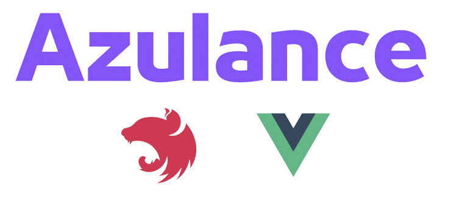
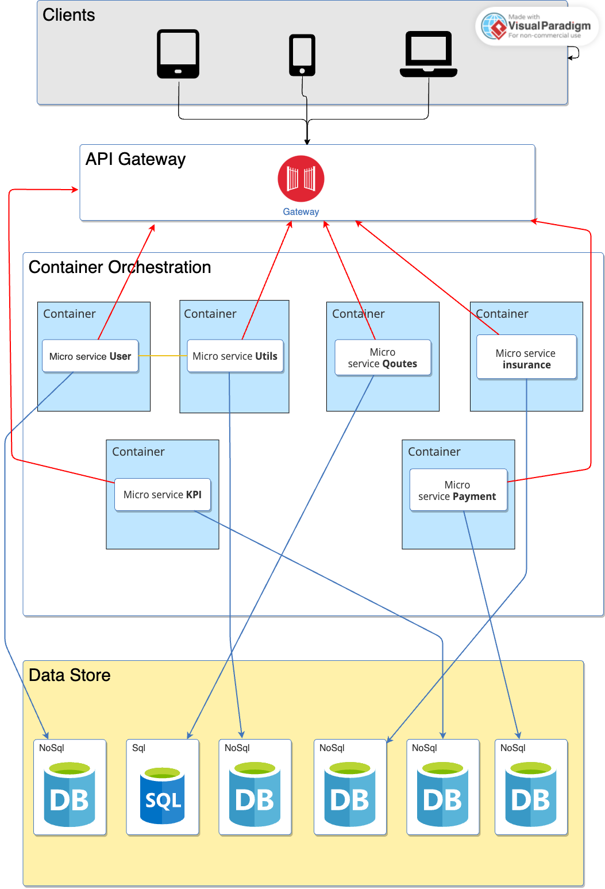

# Challenge app esgi assurance <!-- omit in toc -->



[Azulance](https://github.com/elmohriothmane/Challenge-app-esgi-assurance) is based on the [Nest](https://github.com/nestjs/nest) and [VueJs](https://vuejs.org/) framework.

---


# Table of Contents <!-- omit in toc -->

- [1. Getting Started](#1-getting-started)
  - [1.1. Azulance Architecture](#11-azulance-architecture)
  - [1.2. Installing](#12-installing)
  - [1.3. Running](#13-running)
  - [1.4. Testing](#14-testing)
  - [1.5. Swagger documentation](#15-swagger-documentation)
- [2. Recommended VS Code extensions](#2-recommended-vs-code-extensions)
  - [2.1. Markdown All in One](#21-markdown-all-in-one)
  - [2.2. ESLint](#22-eslint)
- [3. Project description](#3-project-description)
  - [3.1. Project initialization](#31-project-initialization)
  - [3.2. Installed packages](#32-installed-packages)
- [4. workflows](#4-worflows)

---

# 1. Getting Started

## 1.1. Azulance Architecture
Azulance follows a microservices architecture, which is a decentralized architectural style that allows for the development of loosely coupled and independently deployable services. This architecture promotes scalability, flexibility, and resilience. Here is an overview of the Azulance microservices architecture:



## 1.2. Installing

```bash
docker-compose --build
```

## 1.3. Running

```bash
docker-compose up -d
```
## 1.4. Testing

```bash
# unit tests
$ npm run test

# e2e tests
$ npm run test:e2e

# test coverage
$ npm run test:cov
```

## 1.5. Swagger documentation

The Swagger documentation url is `https?://{host_name(:port)?}/api/vX/`.

---

# 2. Recommended VS Code extensions

Here, there is a summary of some recommended `VS Code` extensions.

## 2.1. Markdown All in One

It has some useful functionalities for editing Markdown files like keyboard shortcuts, table of contents, section numbering...

To install the `Markdown All in One` extension to `VS Code`, see [yzhang.markdown-all-in-one](https://marketplace.visualstudio.com/items?itemName=yzhang.markdown-all-in-one).
```sh
code --install-extension yzhang.markdown-all-in-one
```

## 2.2. ESLint

It used to find and fix problems with an integration to the `VS Code` editor, see [eslint.org](https://eslint.org/).

To install the `ESLint` extension to `VS Code`, see [dbaeumer.vscode-eslint](https://marketplace.visualstudio.com/items?itemName=dbaeumer.vscode-eslint).
```sh
code --install-extension dbaeumer.vscode-eslint
```
To show and fix issues, see doc of [dbaeumer.vscode-eslint](https://marketplace.visualstudio.com/items?itemName=dbaeumer.vscode-eslint). For example,
```sh
npm install -g eslint
eslint --init
```

To install additional plugins into a project like
- [`eslint-plugin-import`](https://github.com/benmosher/eslint-plugin-import#readme) with [`eslint-import-resolver-typescript`](https://github.com/alexgorbatchev/eslint-import-resolver-typescript#readme) (?), see also an issue with configs: 
  - [Stack Overflow: Unable to resolve path to module](https://stackoverflow.com/questions/55198502/using-eslint-with-typescript-unable-to-resolve-path-to-module)
  - [Stack Overflow: Module has no exported member](https://stackoverflow.com/questions/65187695/which-rule-to-enable-to-throw-module-has-no-exported-member-in-eslint-cli-outp)
```sh
npm i -D eslint-plugin-import @typescript-eslint/parser eslint-import-resolver-typescript eslint-plugin-simple-import-sort 
```

---

# 3. Project description

## 3.1. Project initialization

This project is created with `NestJS Framework`, see its [documentation](https://docs.nestjs.com/).

- To install `Nest CLI`
```sh
npm i -g @nestjs/cli
```

- To generate this project
```sh
nest Challenge-app-esgi-assurance
```

## 3.2. Installed packages

- Configuration variables environment `.env`
- To define your environment variables, you need to create a .env file. You can find an example file named `.env.example` to assist you. Follow the steps below to set up your environment variables:

    - Copy the `.env.example` file and create a new file called `.env`.

    - Open the `.env` file in a text editor of your choice.

    - Replace the placeholder values in the `.env` file with your specific configuration. Ensure each environment variable is defined correctly for your project.

    - Save the `.env` file.
    
```sh
npm install --save @nestjs/config
```

- `MongoDB` database
```sh
npm install --save @nestjs/mongoose mongoose 
```

- `Swagger` for RESTful APIs descriptions
```sh
npm install --save @nestjs/swagger swagger-ui-express
```

- Data validators
```sh
npm install --save class-validator class-transformer validator
```

- `JWT` authentication with `Passport` (see [JWT Auth with Mongoose](https://github.com/pejmanhadavi/real-world-example-nestjs-mongoose-jwt-auth))
```sh
npm install --save @nestjs/jwt @nestjs/passport passport passport-local passport-jwt bcrypt
npm install --save-dev @types/passport-local @types/passport-jwt
npm install --save argon2
```

## 4. Workflows
In this section, you can provide a high-level overview or summary of the workflows in our project.

For more detailed information about how to use our application, please refer to the [WORKFLOWS.md](WORKFLOWS.md) file. It contains comprehensive instructions and examples for various workflows.

Feel free to explore the file to gain a deeper understanding of the application's functionalities and usage.


---
## Development team
 

- Developer - [Zaid ALAA HAZIM](https://www.linkedin.com/in/zaid-alaa-hazim/)
- Developer - [Othmanei ELMOHRI](https://www.linkedin.com/in/othmane-elmohri/)
- Developer - [Slimane ACHBOUQ](https://www.linkedin.com/in/slimane-achbouq/)
- Developer - [Zakaria Attaoui](https://www.linkedin.com/in/zakaria-attaoui-29b24b1b2/)
---
<p align="center">
  <a href="https://www.esgi.fr/" target="blank"></a>
</p>

---